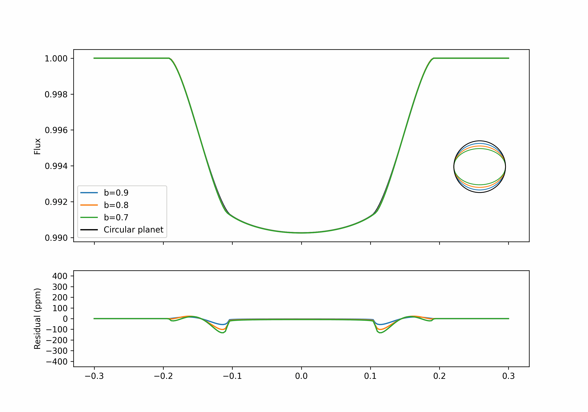

# Eclipsoid

`eclipsoid` is a package for fast and differentiable transit models of oblate and prolate planets in [JAX](https://docs.jax.dev/en/latest/) built on top of the [`jaxoplanet`](https://jax.exoplanet.codes/en/latest/) package. Our API largely follows `jaxoplanet`; you can read the [`jaxoplanet` docs](https://jax.exoplanet.codes/en/latest/) for info on how to model a basic exoplanet transits.




## Installation

`eclipsoid` requires JAX as a dependency, which must be installed first:
```bash
pip install "jax[cpu]"
```

You can then install `eclipsoid` via pip:
```bash
pip install eclipsoid
```

Alternatively, you can get `eclipsoid` from source with git:
```bash
git clone https://github.com/shishirdholakia/eclipsoid.git
cd eclipsoid
pip install -e .
```
## Attribution

Please cite the [`eclipsoid` paper](https://arxiv.org/abs/2410.03449) if you use this package for your publication:
```
@ARTICLE{2024arXiv241003449D,
       author = {{Dholakia}, Shashank and {Dholakia}, Shishir and {Pope}, Benjamin J.~S.},
        title = "{A General, Differentiable Transit Model for Ellipsoidal Occulters: Derivation, Application, and Forecast of Planetary Oblateness and Obliquity Constraints with JWST}",
      journal = {arXiv e-prints},
     keywords = {Astrophysics - Earth and Planetary Astrophysics, Astrophysics - Instrumentation and Methods for Astrophysics},
         year = 2024,
        month = oct,
          eid = {arXiv:2410.03449},
        pages = {arXiv:2410.03449},
          doi = {10.48550/arXiv.2410.03449},
archivePrefix = {arXiv},
       eprint = {2410.03449},
 primaryClass = {astro-ph.EP},
       adsurl = {https://ui.adsabs.harvard.edu/abs/2024arXiv241003449D},
      adsnote = {Provided by the SAO/NASA Astrophysics Data System}
}
```
